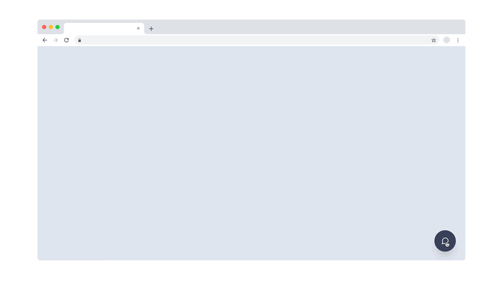
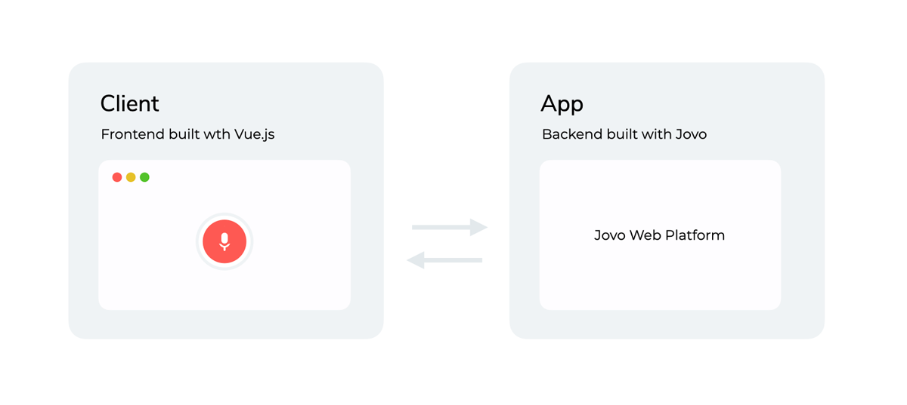

# Jovo Web Starter: Chat Widget

Fully customizable open source chat widget that can be added to any website.

Built with the [Jovo Framework](https://github.com/jovotech/jovo-framework), [React](https://github.com/facebook/react/), and [Tailwind CSS](https://github.com/tailwindlabs/tailwindcss).



> Support Jovo by starring [our main repo](https://github.com/jovotech/jovo-framework) or joining [our Open Collective](https://opencollective.com/jovo-framework).

- [Getting Started](#getting-started)
- [How it works](#how-it-works)
- [Customization](#customization)
  - [Client](#client)
  - [App](#app)
- [Deployment](#deployment)
- [About Jovo](#about-jovo)

## Getting Started

1.  **Download starter**

    Clone this repository and install the dependencies:

    ```sh
    git clone https://github.com/jovotech/jovo-starter-web-chatwidget-react.git

    cd jovo-starter-web-chatwidget-react

    npm install
    ```

2.  **Start client (React)**

    ```sh
     $ cd client

     # Start React frontend
     $ npm run start
    ```

3.  **Start app (Jovo)**
    In a new tab:

    ```sh
    $ cd app

    # Start Jovo development server
    $ npm run start:dev
    ```

4.  **Open the starter in your browser at `http://localhost:3001`.**

## How it works



This repository contains:

- `app`: Backend logic built with the [Jovo Framework](https://github.com/jovotech/jovo-framework) using its [Web Platform integration](https://github.com/jovotech/jovo-framework/tree/v4/latest/platforms/platform-web).
- `client`: Frontend built with [React](https://reactjs.org/) and [Tailwind CSS](https://tailwindcss.com/), communicating with the backend using the [Jovo Web Client](https://github.com/jovotech/jovo-framework/tree/v4/latest/clients/client-web).

## Customization

The starter was built for you to have a working example as well as an entry point to get started with the Jovo Web integration.

The following documentation will help you understand how the starter is structured and which components take care of which tasks.

### Client

If you are new to React and want to develop your website starting with this project, you can take a look at the React guide [here](https://reactjs.org/docs/getting-started.html). This will give you a quick start to how React works, so you can start creating right away.

### App

The Jovo app utilizes the new [Jovo Web Platform integration](http://jovo.tech/marketplace/platform-web) as well as [NLP.js](https://www.jovo.tech/marketplace/nlu-nlpjs) as its NLU. It implements a simple interaction where the user can be redirected to the Jovo Framework's documentation.

#### Language Model

The language model consists of two intents, `HelloWorldIntent` and `YesIntent`, used to implement the sample interaction.

## Deployment

### Client

> Take a look at the React deployment docs [here](https://create-react-app.dev/docs/deployment/).

To integrate the Jovo Chat Widget into your existing project, you can use the npm script `build` inside of the `client/` directory. This will produce a bundle in a dedicated `build/` directory, containing the whole React client with minified HTML, CSS and JavaScript, ready for dynamic integration into any website.

### App

You can host your Jovo app on almost any platform, whether you choose a hosting provider or to build your own Node.js-based HTTP server. Here are a few examples:

- [AWS Lambda](https://www.jovo.tech/marketplace/server-lambda)
- [Express](https://www.jovo.tech/marketplace/server-express)

## About Jovo

Jovo is the most popular development framework for voice, including platforms like Alexa, Google Assistant, and the web.

- [Jovo Website](https://jovo.tech/)
- [Documentation](https://jovo.tech/docs/)
- [Marketplace](https://www.jovo.tech/marketplace/)
- [Twitter](https://twitter.com/jovotech/)
- [Forum](https://community.jovo.tech/)
